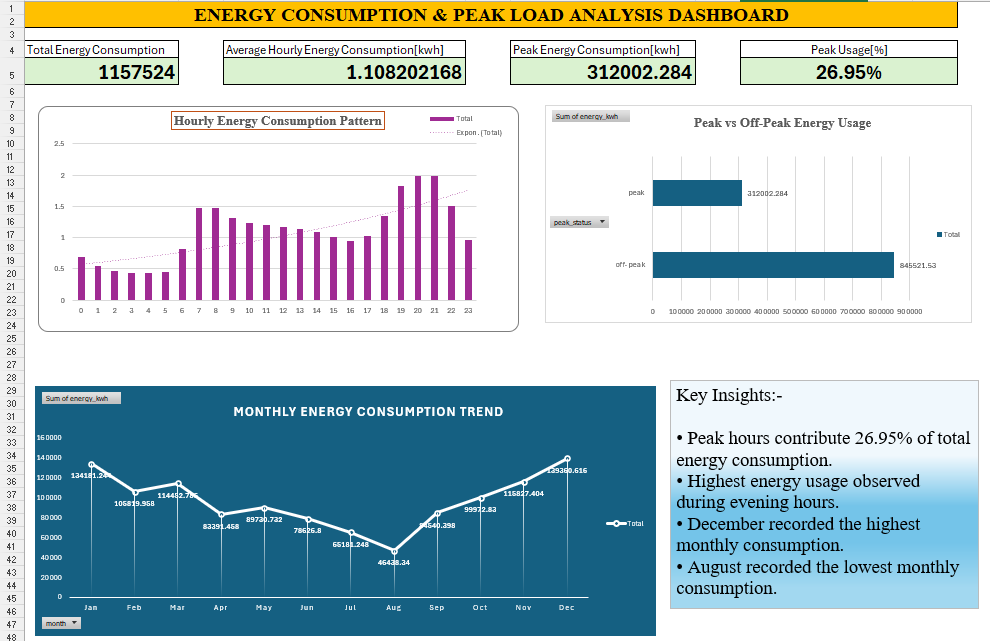
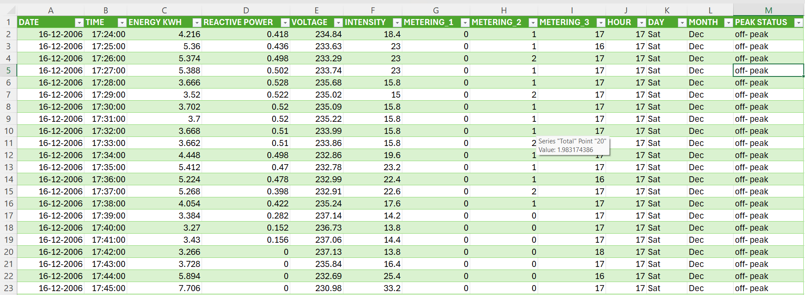
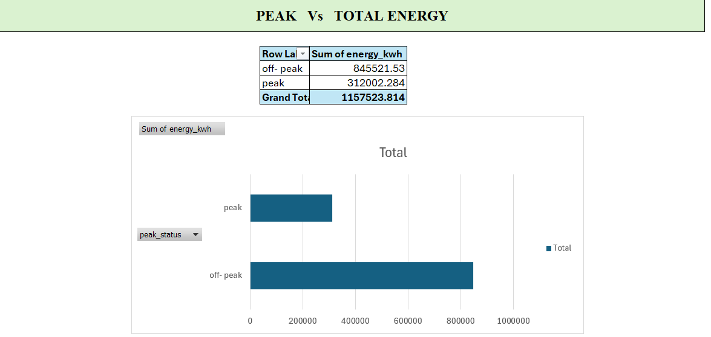
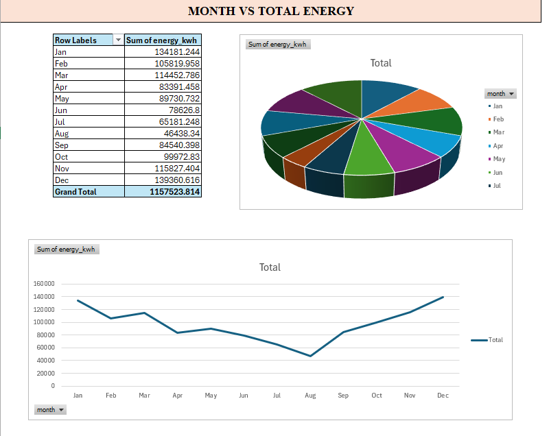

# ⚡ Energy Consumption & Peak Load Analysis

## 📌 Project Overview

This project analyzes more than **1 million household energy consumption records** to identify consumption patterns, peak load behavior, and seasonal energy trends.

Using **Python, Pandas, Power Query, and Advanced Excel**, raw energy data was transformed into actionable insights through data cleaning, feature engineering, and dashboard development.

The project aims to support energy optimization and load management by understanding when and how electricity is consumed.

---

## 📊 Dataset Information

| Attribute | Details |
|------------|------------|
| Records | 1,048,575+ |
| Features | 9+ Variables |
| Time Granularity | Minute-Level Energy Data |
| Domain | Energy Analytics |
| File Type | CSV / Excel |

### Key Variables

- Energy Consumption (kWh)
- Reactive Power
- Voltage
- Intensity
- Metering 1
- Metering 2
- Metering 3
- Hour
- Day
- Month
- Peak Status

---

## 🛠️ Tools & Technologies

- Python
- Pandas
- NumPy
- Advanced Excel
- Power Query
- Pivot Tables
- Data Visualization
- GitHub

---

## 📈 Key Performance Indicators (KPIs)

| KPI | Value |
|------|------|
| Total Energy Consumption | 1,157,524 kWh |
| Average Hourly Consumption | 1.108 kWh |
| Peak Energy Consumption | 312,002 kWh |
| Peak Usage Percentage | 26.95% |

---

## 🔍 Analysis Performed

### Data Cleaning

- Removed inconsistencies
- Handled missing values
- Standardized formats

### Feature Engineering

Created:

- Hour
- Day
- Month
- Peak / Off-Peak Indicator

### Energy Analysis

- Hourly consumption trends
- Monthly energy trends
- Peak vs Off-Peak comparison
- Load distribution analysis

---

## 💡 Key Insights

### Peak Consumption

Peak hours account for approximately **27% of total energy usage**.

### Energy Demand Pattern

Energy consumption increases significantly during evening hours (**6 PM – 9 PM**).

### Seasonal Trend

Energy usage decreases during mid-year months and increases toward year-end.

### Optimization Opportunity

Shifting energy-intensive activities away from peak hours can reduce load pressure and improve overall energy efficiency.

---

## 📷 Dashboard Screenshots

### Dashboard Overview

### Dataset Structure

### Peak Load Analysis

### Monthly Trend Analysis

---

## 📁 Repository Contents

- Household_Energy_Consumption_Sample.csv
- Energy_Dashboard.xlsx
- Energy_Consumption_Analysis.ipynb
- Screenshots/
- README.md

---

## 📝 Note

The original dataset contains **1,048,575+ records**. A representative sample dataset has been uploaded to GitHub due to file size limitations.

---

## 👨‍💻 Author

**Mayuresh Ravindra Patil**

📍 Nandurbar, Maharashtra, India

### Skills

- Data Analytics
- Python
- SQL
- Power BI
- Advanced Excel
- Data Visualization

### LinkedIn

www.linkedin.com/in/mayuresh-patil-8b723a196

---

## 🚀 Portfolio Projects

### Project 1
📊 Trader Performance Intelligence & Risk Analytics Platform

### Project 2
⚡ Energy Consumption & Peak Load Analysis

---

⭐ If you found this project interesting, feel free to explore the repository and connect with me on LinkedIn.
